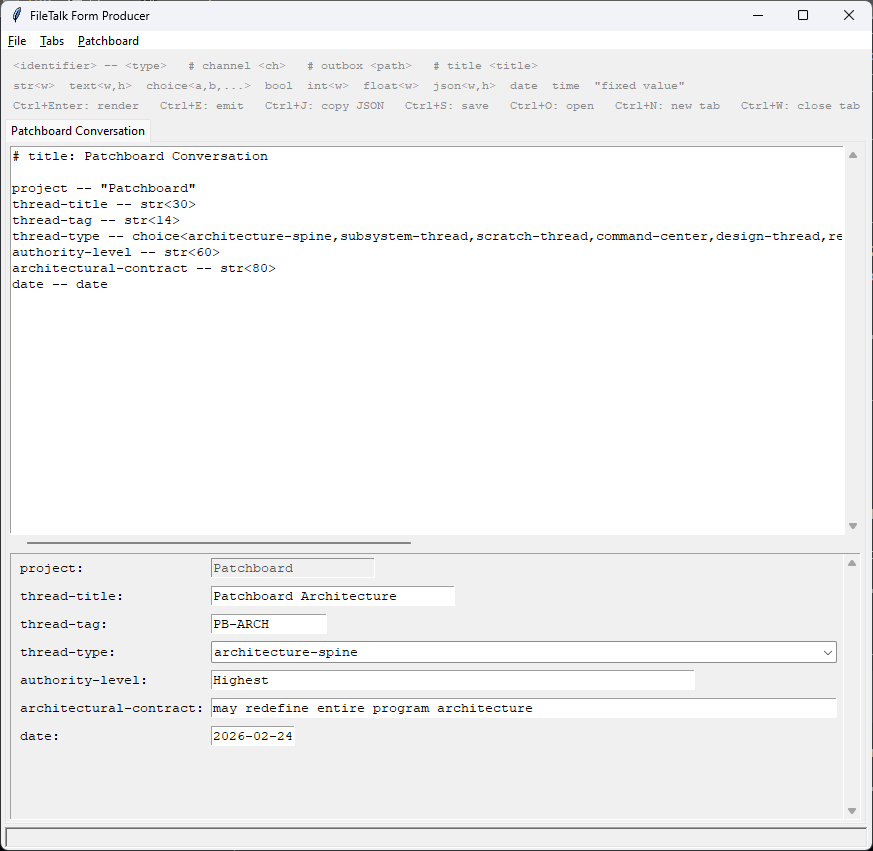

# FileTalk Form Producer



A desktop GUI tool for the [Patchboard](https://github.com/LionKimbro/filetalk) system. You describe a form in a simple text DSL, press a key, and a live form appears. Fill it in and emit the result as a Patchboard JSON message — ready for any other Patchboard component to consume. If you're not using Patchboard, you can also copy the filled-in JSON directly to the clipboard with **Ctrl+J**.

---

## What it does

1. You write a form description in the editor (top half of the window).
2. Press **Ctrl+Enter** to render the form (bottom half).
3. Fill in the fields.
4. Press **Ctrl+E** to emit the filled-in form as a JSON message into the **OUTBOX** directory.

Any Patchboard component watching that OUTBOX will receive the message on the configured channel.

---

## Installation

```
pip install -e .
```

Requires Python 3.10+. No third-party GUI dependencies — uses the `tkinter` standard library module.

---

## Running

```
form-producer
```

On first run, a `.form-producer/` directory is created in the current folder. This holds persistent configuration and, by default, the INBOX and OUTBOX directories.

---

## The form description DSL

Each line is either a **field definition**, a **directive**, or a **comment**.

### Field definition

```
identifier -- type
```

Fields appear in the rendered form in the order they are written.

### Field types

| Type | Syntax | Description |
|---|---|---|
| String | `str<width>` | Single-line text entry |
| Text | `text<width,height>` | Multi-line text area |
| Choice | `choice<a,b,c,...>` | Drop-down selector |
| Boolean | `bool` | Checkbox |
| Integer | `int<width>` | Whole numbers only |
| Float | `float<width>` | Decimal numbers |
| JSON | `json<width,height>` | Free-form JSON value |
| Date | `date` | Auto-fills with today's date (yyyy-mm-dd), editable |
| Time | `time` | Auto-fills with current time (hh:mm:ss), editable |
| Fixed | `"literal value"` | Read-only field; always emits the same string |

### Directives

```
# channel: my-channel
# outbox: /path/to/outbox
# title: My Form Name
```

- **`# channel:`** — the channel name the emitted message will carry.
- **`# outbox:`** — override the OUTBOX directory for this form.
- **`# title:`** — sets the tab label.

### Comments

Any `#` line that isn't a recognized directive is treated as a plain comment and ignored.

### Example

```
# title: Bug Report
# channel: bugs

summary    -- str<60>
severity   -- choice<low,medium,high,critical>
reproducible -- bool
details    -- text<60,8>
reported   -- date
```

---

## Emitted message format

[Patchboard messages](https://github.com/LionKimbro/filetalk/blob/main/docs/spec/patchboard-core.v1.json) are published following the [Patchboard FileTalk transport format](https://github.com/LionKimbro/filetalk/blob/main/docs/spec/patchboard-file-transport.v1.md):

```json
{
  "channel": "bugs",
  "timestamp": "1708732800.123456",
  "signal": {
    "summary": "Login fails on mobile",
    "severity": "high",
    "reproducible": true,
    "details": "Steps to reproduce...",
    "reported": "2026-02-24"
  }
}
```

The file is written to the OUTBOX directory with a UUID filename (`<uuid>.json`).

---

## Tabs

You can work on multiple forms at once. Each tab has its own DSL editor and rendered form.

- **Ctrl+N** — open a new tab
- **Ctrl+W** — close the current tab
- **Tab menu → New Tab / Close Tab** — same via menu

Switching to a tab automatically re-renders its form from the current DSL text. If a form spec arrives via INBOX, it opens in a new tab automatically.

---

## Menus and keybindings

### File
| Action | Key |
|---|---|
| Open Description | Ctrl+O |
| Save Description | Ctrl+S |
| Exit | — |

### Tabs
| Action | Key |
|---|---|
| New Tab | Ctrl+N |
| Close Tab | Ctrl+W |

### Patchboard
| Action | Key |
|---|---|
| Emit JSON to: *channel* | Ctrl+E |
| Emit component card | — |
| Copy JSON to clipboard | Ctrl+J |
| Copy component card to clipboard | — |
| Open Inbox | — |
| Open Outbox | — |

---

## Configuration

Form Producer uses [lionscliapp](https://github.com/LionKimbro/lionscliapp) for persistent configuration. Settings are saved in `.form-producer/config.json`.

```
form-producer set path.outbox /path/to/my/outbox
form-producer set path.inbox  /path/to/my/inbox
form-producer set channel     my-channel
```

```
form-producer get path.outbox
form-producer keys
```

Default values:

| Key | Default |
|---|---|
| `path.outbox` | `.form-producer/OUTBOX` |
| `path.inbox` | `.form-producer/INBOX` |
| `channel` | `output` |

DSL directives (`# channel:`, `# outbox:`) override the configured defaults for that specific form.

---

## INBOX — receiving forms remotely

If the INBOX directory exists and contains a Patchboard message on channel `text` whose signal is a string, Form Producer loads that string into a new tab as a form description and renders it immediately.

This lets other Patchboard components push form descriptions to Form Producer at runtime.

Use **Patchboard → Open Inbox** to create and open the INBOX directory.

---

## Component card

Form Producer can announce itself to the Patchboard system by emitting a **component ID card** — a structured description of its inbox, outbox, and channels.

- **Patchboard → Emit component card to: card** — emits the card as a Patchboard message (channel `card`) to the OUTBOX.
- **Patchboard → Copy component card to clipboard** — copies the card JSON.

You can also generate the card from the command line:

```
form-producer make-card
form-producer make-card --card-path /path/to/output.json
```

The card format is compatible with [Patchboard Atlas](https://github.com/LionKimbro/patchboard-atlas).

---

## Channel priority

The effective channel for an emitted message is resolved in this order:

1. `# channel:` directive in the current form DSL
2. `path.channel` / `channel` key from persistent config (`form-producer set channel ...`)
3. Built-in default: `output`
